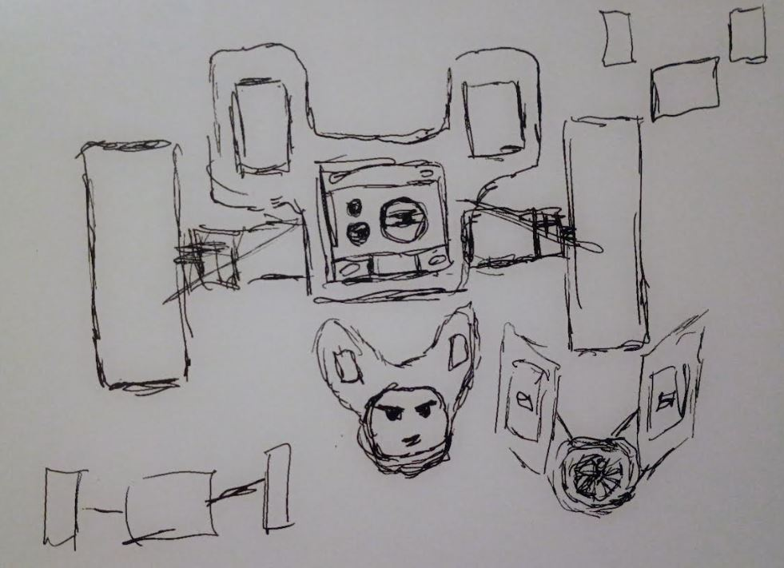

### 05/11/2026

5:35 PM

Trying to get this data onto a websocket then rendered in ThreeJS

Saw microdot mentioned and then this hackster guide

https://www.hackster.io/517188/how-to-build-web-socket-on-raspberry-pi-pico-w-and-make-live-cbafe3

6:24 PM

Making progress

6:45 PM

Onto the ThreeJS part

---

### 05/10/2026

9:16 PM

Flashed pi pico w first time

Working on interfacing with VL53L5CX sensor

11:40 PM

Well that took me a bit but I got it to work cool

---

### 04/29/2026

11:40 PM

Oh no here we go another project as I haven't finished the other ones...

I at least will follow my rule of not making the repo public until I have something tangible to present

I just found some parts I had on hand and recorded a couple videos

I have an idea on the design

This will be a project I work on as a break from writing code/day job

I'm using these foam RC plane wheels

The main feature is the OLED as a face and then two ToF 8x8 grid sensors... I guess they're kind of like ears

The human-like face or Ratchet and Clank like, Kangaroo maybe... is kind of odd since it has wheels

So I'm going for a more animated robotic face look eg. a lens as an eye

Aside from being fun what I'm hoping to get out of this project is more practice with C++, using the Pico finally, using these grid sensors that are new to me (looking to use it on a robot plant watering arm) and more experience with the IMU
